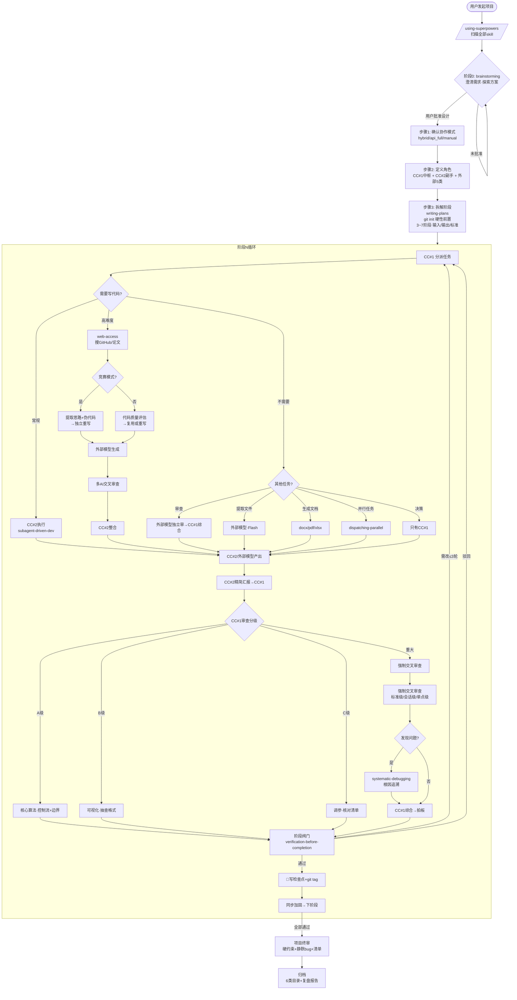
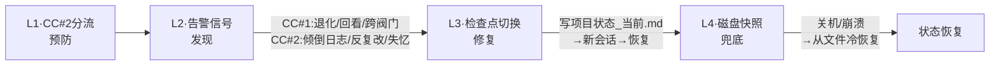
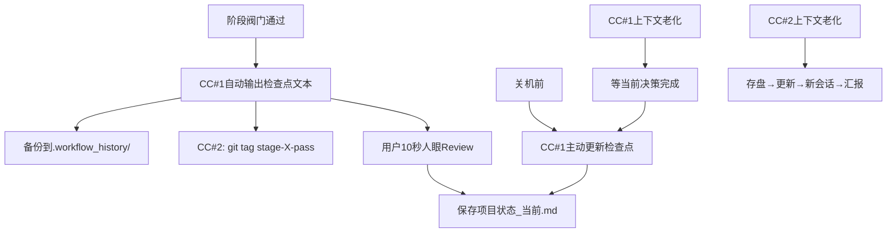
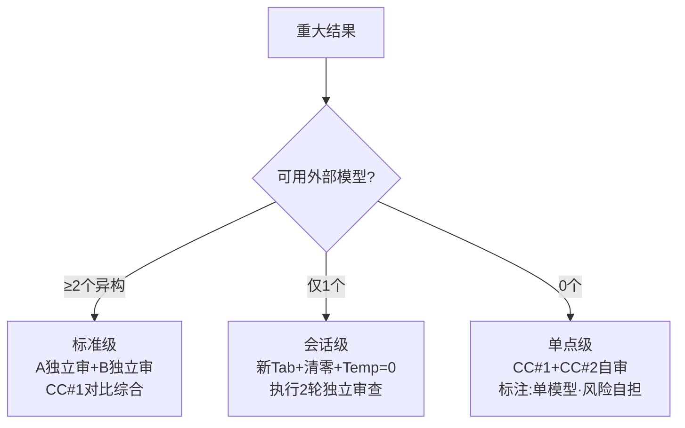
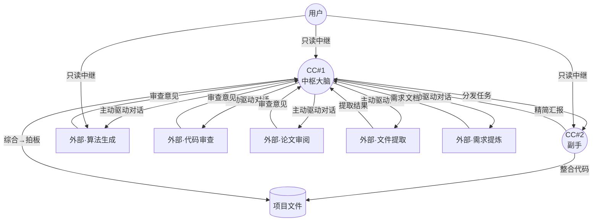

# 多AI协作工作流 v2.1 — Mermaid流程图

> 以下图表可在支持Mermaid的Markdown渲染器中直接查看（VS Code/GitHub/Notion）。
> 如无法渲染，用浏览器打开 `多AI协作工作流_全景图.html`。

## 一、主流程

## 二、四层上下文防御

## 三、检查点操作

## 四、强制交叉审查三降级

## 五、角色关系

---

> v2.1 星型中枢架构 | 2026-05-25
